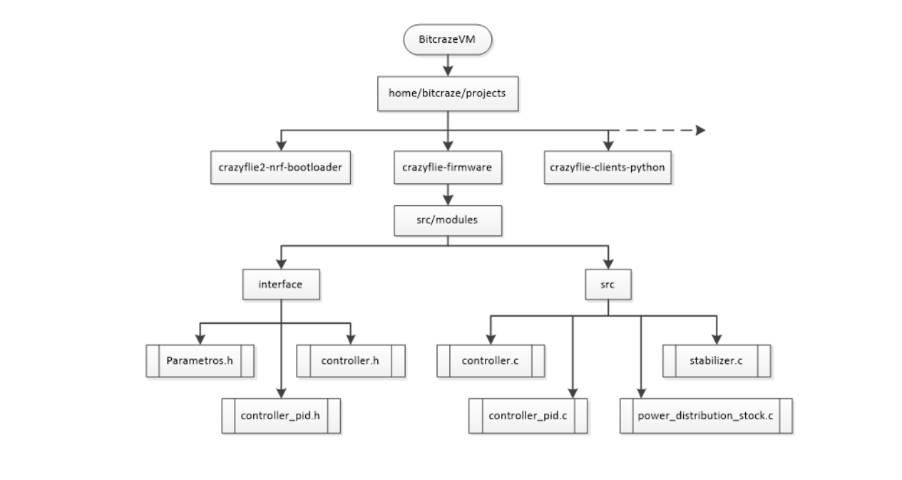
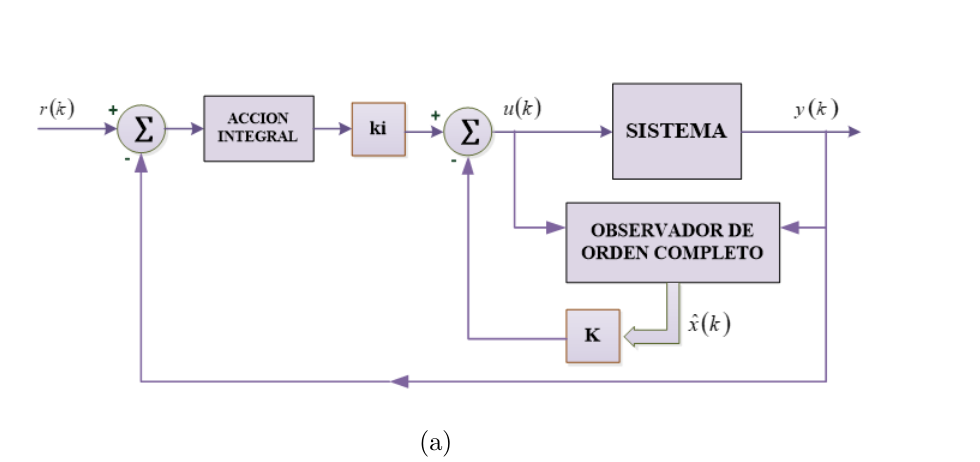
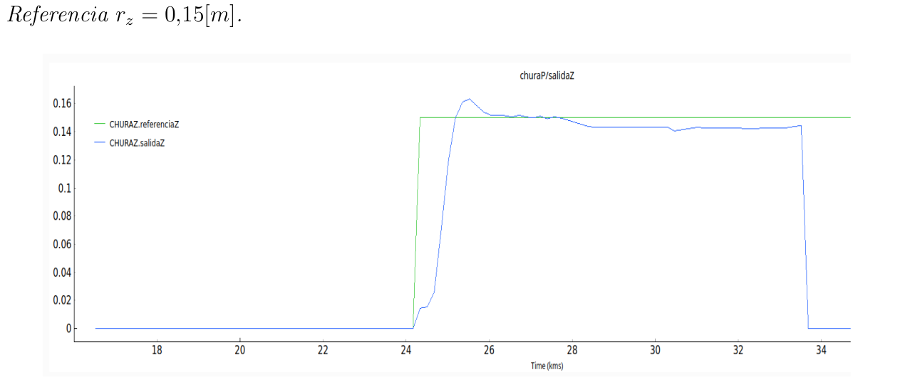
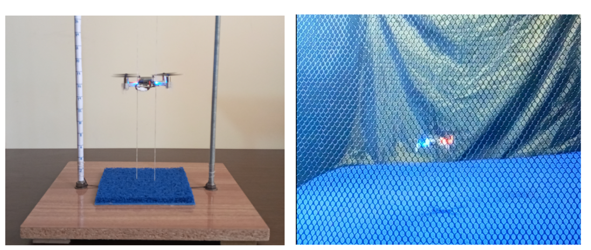

# HOVER FUNCTION

This repository contains the necessary files that should be replaced in the firmware of [Crazyflie 2.0 (bitcraze)](https://www.bitcraze.io/products/crazyflie-2-1/) to obtain a hover functionality in the dron. The project uses the dron and the FlowDeck which is an optic sensor that measures the distance floor-drone.

Hovering refers to the ability of an object, in this case, a drone, to maintain a stationary position in mid-air. This is achieved by producing a lift equivalent to its weight, giving the illusion of defying gravity.

## Firmware implementation

The structure of the [firmware](https://www.bitcraze.io/documentation/repository/crazyflie-firmware/master/functional-areas/sensor-to-control) of the crazyflie can be see in the next figure

## Structure of the system

The system of control that uses a robust controller an a state estimator can be seen in the next figure

## Results

We can see the resulf of the thrust controller and the way the experiments were done with the dron 

